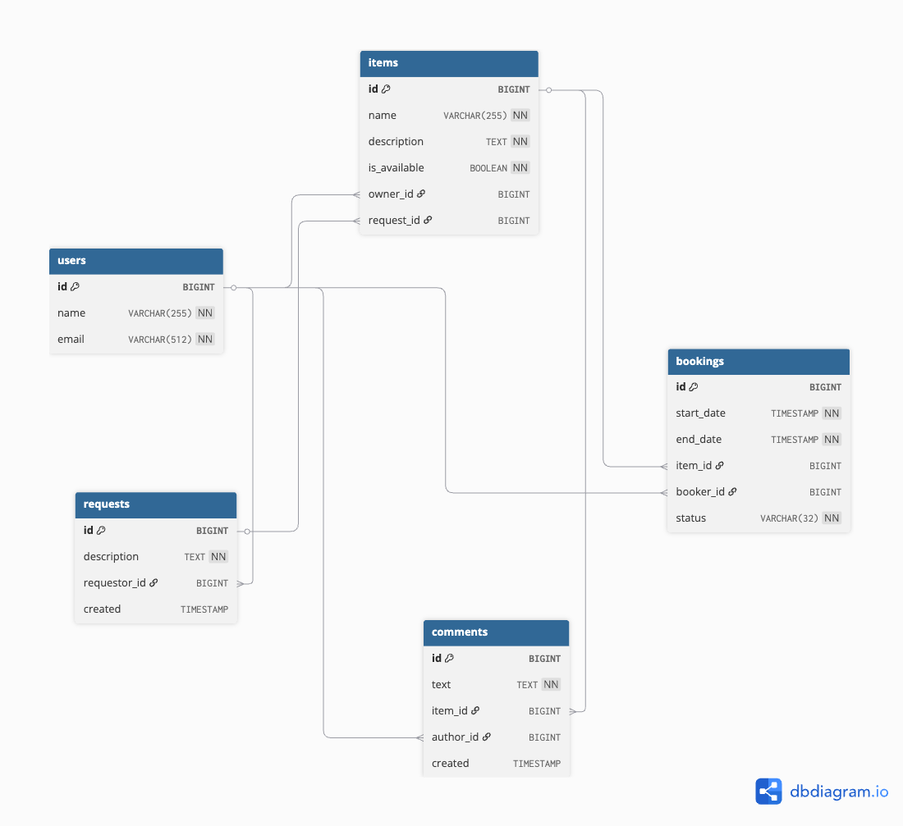

# 🚀 ShareIt — Сервис управления вещами и бронированиями

**ShareIt** — это микросервисное приложение для управления вещами, их бронирования и комментариев, с поддержкой запросов на вещи и пользовательских профилей.  
Проект состоит из двух модулей: `server` (REST API + бизнес-логика + БД) и `gateway` (REST-клиенты для взаимодействия с сервером).

---

## 🏗 Архитектура проекта

Client → Gateway → Server → PostgreSQL


- **Gateway** — REST-клиенты (`BaseClient`) для маршрутизации запросов от фронтенда к серверу
- **Server** — контроллеры, сервисы и репозитории (Spring Boot, JPA, транзакции)
- **PostgreSQL** — хранение пользователей, вещей, бронирований, комментариев и запросов на вещи
- **Docker Compose** — поднимает всю систему с сервером, гейтвеем и БД

---

## 🛠 Технологический стек

- **Язык:** Java 21  
- **Фреймворк:** Spring Boot 3 (Web, Validation, JPA)  
- **База данных:** PostgreSQL 16.1  
- **Модули:** `gateway` и `server`  
- **Инструменты:** Maven, Lombok, Checkstyle, SpotBugs, Jacoco  
- **Контейнеризация:** Docker & Docker Compose

---

## 📦 Функционал

### Пользователи
- CRUD для пользователей
- Получение всех пользователей и по ID
- Обновление и удаление пользователей

### Вещи (Items)
- CRUD вещей с проверкой доступности
- Получение всех вещей пользователя или по ID
- Поиск вещей по тексту
- Добавление комментариев к вещам

### Бронирования (Bookings)
- Создание бронирования
- Обновление статуса (одобрение/отклонение)
- Получение бронирований пользователя и владельца
- Фильтрация по состоянию (`ALL`, `WAITING`, `APPROVED`, `REJECTED` и т.д.)

### Запросы на вещи (Item Requests)
- Создание запроса на вещь
- Получение запросов пользователя
- Получение всех запросов и конкретного запроса по ID

---

## 🧱 База данных

Схема PostgreSQL:

- `users` — пользователи
- `items` — вещи
- `bookings` — бронирования
- `requests` — запросы на вещи
- `comments` — комментарии к вещам

## Диаграмма базы данных



---

## 🏗 Архитектура кода

### Сервер (`server`)
- **Controller → Service → Repository → Database**
- Контроллеры: `UserController`, `ItemController`, `BookingController`, `ItemRequestController`
- Сервисы: бизнес-логика, транзакции, валидация
- Репозитории: JPA интерфейсы и кастомные запросы
- DTO и мапперы для трансформации данных

### Гейтвей (`gateway`)
- `BaseClient` для универсальных REST-запросов
- Клиенты: `UserClient`, `ItemClient`, `BookingClient`, `RequestClient`
- Логирование запросов и обработка ошибок

---

## 📦 Docker Compose

Поднимает всю систему:

```yaml
services:
  gateway:
    build: gateway
    ports: ["8080:8080"]
    depends_on: [server]

  server:
    build: server
    ports: ["9090:9090"]
    depends_on: [db]

  db:
    image: postgres:16.1
    ports: ["6541:5432"]
    environment:
      POSTGRES_DB: shareit
      POSTGRES_USER: shareit
      POSTGRES_PASSWORD: shareit
```

- Gateway доступен на http://localhost:8080
- Server доступен на http://localhost:9090
- PostgreSQL доступен на localhost:6541

# 🚀 Запуск проекта

## Локально через Maven

### Сборка
```
mvn clean package
```

### Запуск серверного модуля
```
mvn -pl server spring-boot:run
```

### Запуск гейтвея
```
mvn -pl gateway spring-boot:run
```

## Через Docker Compose
```
docker-compose up --build
```

# ShareIt API

REST API для сервиса обмена вещами **ShareIt**.  
Проект разделён на **server** (бизнес-логика) и **gateway** (REST API клиент).

---

## Пользователи (Users)

| Метод | Путь | Описание | Параметры |
|-------|------|----------|-----------|
| GET | `/users` | Получить всех пользователей | — |
| GET | `/users/{userId}` | Получить пользователя по ID | `userId` (path) |
| POST | `/users` | Создать нового пользователя | Body: `UserDto` |
| PATCH | `/users/{userId}` | Обновить данные пользователя | `userId` (path), Body: `UpdateUserDto` |
| DELETE | `/users/{userId}` | Удалить пользователя | `userId` (path) |

---

## Вещи (Items)

| Метод | Путь | Описание | Параметры |
|-------|------|----------|-----------|
| GET | `/items` | Получить все вещи пользователя | `X-Sharer-User-Id` (header) |
| GET | `/items/{itemId}` | Получить вещь по ID | `itemId` (path), `X-Sharer-User-Id` (header) |
| POST | `/items` | Создать вещь | `X-Sharer-User-Id` (header), Body: `ItemDto` |
| PATCH | `/items/{itemId}` | Обновить вещь | `X-Sharer-User-Id` (header), `itemId` (path), Body: `UpdateItemDto` |
| GET | `/items/search?text={text}` | Поиск вещей по тексту | `text` (query) |
| POST | `/items/{itemId}/comment` | Добавить комментарий к вещи | `X-Sharer-User-Id` (header), `itemId` (path), Body: `CommentDto` |

---

## Бронирования (Bookings)

| Метод | Путь | Описание | Параметры |
|-------|------|----------|-----------|
| POST | `/bookings` | Создать бронирование | `X-Sharer-User-Id` (header), Body: `RequestBookingDto` |
| PATCH | `/bookings/{bookingId}?approved={true/false}` | Обновить статус бронирования | `X-Sharer-User-Id` (header), `bookingId` (path), `approved` (query) |
| GET | `/bookings/{bookingId}` | Получить бронирование по ID | `X-Sharer-User-Id` (header), `bookingId` (path) |
| GET | `/bookings?state={state}` | Получить все бронирования пользователя с фильтром | `X-Sharer-User-Id` (header), `state` (query) |
| GET | `/bookings/owner?state={state}` | Получить бронирования вещей пользователя как владельца | `X-Sharer-User-Id` (header), `state` (query) |

---

## Запросы на вещи (Item Requests)

| Метод | Путь | Описание | Параметры |
|-------|------|----------|-----------|
| POST | `/requests` | Создать запрос на вещь | `X-Sharer-User-Id` (header), Body: `ItemRequestDto` |
| GET | `/requests` | Получить запросы пользователя | `X-Sharer-User-Id` (header) |
| GET | `/requests/all` | Получить все запросы кроме своих | `X-Sharer-User-Id` (header) |
| GET | `/requests/{requestId}` | Получить запрос по ID | `X-Sharer-User-Id` (header), `requestId` (path) |


